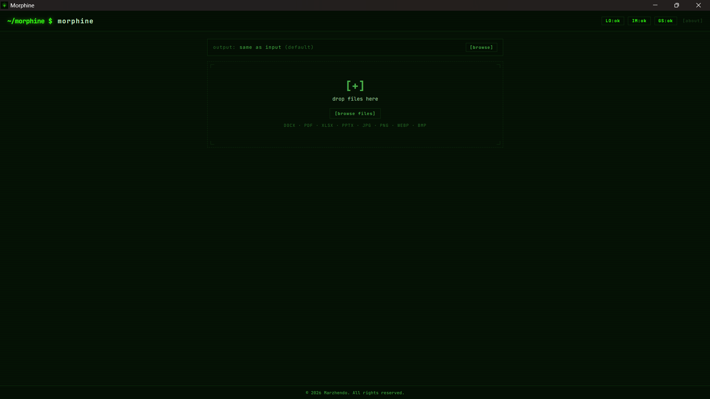
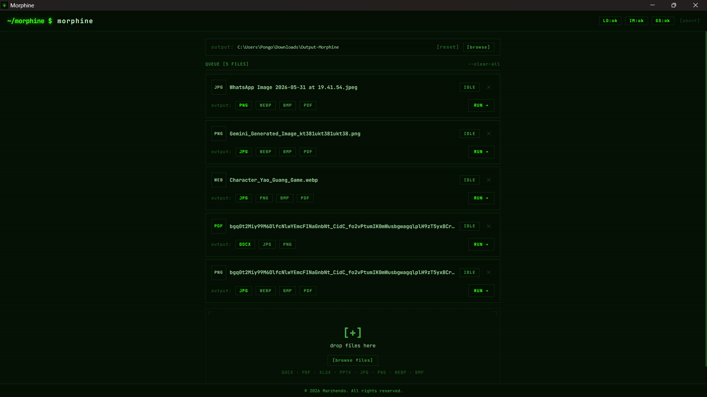

<p align="center">
  
</p>

# <p align="center">🧬 Morphine</p>
<p align="center"><strong>Transform anything, instantly.</strong></p>

`Morphine` is an enterprise-grade, privacy-first, 100% offline desktop application designed for ultra-fast, local file format conversions. Built with a robust **Tauri v2** backend (Rust) and an interactive **React (TypeScript)** frontend, Morphine processes your files entirely on your machine—no cloud uploads, no external APIs, and zero data tracking.

---

## 💡 The "Why" Behind Morphine

Traditional web-based converters are fundamentally broken for daily professional workflows:
* **Network Dependency**: They require active internet connections to upload and download files.
* **Latency & Slowness**: Upload queues, remote processing times, and congested servers result in a slow, frustrating user experience.
* **Bandwidth & Size Limits**: Free tiers aggressively restrict file sizes and cap conversion counts, disrupting heavy workloads.
* **Privacy & Security Risks**: Uploading proprietary data or private documents to third-party web servers introduces massive compliance and confidentiality concerns.

**Morphine** was created to solve these exact frustrations. Built out of a desire for a fast, reliable, and unlimited daily utility, it brings advanced batch conversion engines directly onto your workstation. No limits, no tracking, just instant results.

---

## 🚀 Key Features

* 🔒 **100% Local & Privacy-First**: Zero telemetry. Files never leave your local system.
* ⚡ **High-Performance Engines**: Employs industry-standard headless libraries for enterprise-level accuracy and speed.
* 📦 **Unlimited Conversions**: No file size caps, no daily quotas, and no queue waiting times.
* 🛠️ **Seamless UX**: High-fidelity terminal-themed dashboard featuring interactive status monitoring, simple drag-and-drop triggers, and direct output path selection.
* 💼 **Enterprise Metadata Ready**: Built-in production installer configurations ready for corporate packaging and distribution.

---

## 📸 Application Showcase

Here is a preview of the Morphine terminal-style dashboard and conversion workflow:

<p align="center">
  
  <br />
  <em>The main interface with drag-and-drop support and active tool status pills.</em>
</p>

<p align="center">
  
  <br />
  <em>Output path configuration and live conversion job queue tracking.</em>
</p>

---

## 🔄 Supported Conversion Formats

Morphine leverages dedicated local engines to cover a comprehensive suite of conversions:

| Category | Input Formats | Target Output Formats | Processing Engine |
| :--- | :--- | :--- | :--- |
| **Documents** | `.docx` | `.pdf` | LibreOffice Headless |
| **Spreadsheets** | `.xlsx` | `.pdf` | LibreOffice Headless |
| **Presentations** | `.pptx` | `.pdf` | LibreOffice Headless |
| **PDF Conversion** | `.pdf` | `.docx` | LibreOffice Headless |
| **PDF Extraction** | `.pdf` | `.jpg`, `.png` | Ghostscript + ImageMagick |
| **Images** | `.jpg`, `.jpeg`, `.png`, `.webp`, `.bmp` | `.jpg`, `.png`, `.webp`, `.bmp`, `.pdf` | ImageMagick |

---

## 🛠️ Architecture & Stack

Morphine utilizes a lightweight, high-performance architecture:
* **Frontend**: React (TypeScript), styled with Tailwind CSS, utilizing **Zustand** for state management and **React Query** for Tauri IPC bindings.
* **Backend**: Rust (**Tauri v2**) orchestrating OS threads, event emissions, and local external binary invocations.
* **Engines**: Portable, self-managed local binaries (LibreOffice Portable, ImageMagick, Ghostscript) resolved dynamically via a local registry to avoid system environment pollution.

---

## 🔧 Development & Setup

### Prerequisites
* [Node.js](https://nodejs.org/) (v18+)
* [Rust & Cargo](https://www.rust-lang.org/tools/install)
* [Tauri Prerequisites](https://tauri.app/v2/guides/start/prerequisites/)

### 1. Installation
Clone the repository and install npm dependencies:
```bash
npm install
```

### 2. Run in Development Mode
Launch the interactive Tauri development environment with hot-reloading:
```bash
npm run tauri dev
```

### 3. Verification & Typechecking
Ensure frontend TypeScript type safety before packaging:
```bash
npm run typecheck
```

### 4. Build Production Bundle (MSI)
Build the standalone Windows binary and bundle it inside a secure, packaged Windows Installer (`.msi`) featuring signed publisher metadata:
```bash
npm run tauri build
```
The compiled installer will be available at:
`src-tauri/target/release/bundle/msi/Morphine_0.1.0_x64_en-US.msi`

---

## ⚖️ License & Copyright

Designed, developed, and maintained by **Marzhendo**.

```
© 2026 Marzhendo. All rights reserved.
```
All product names, logos, and brands are property of their respective owners.
